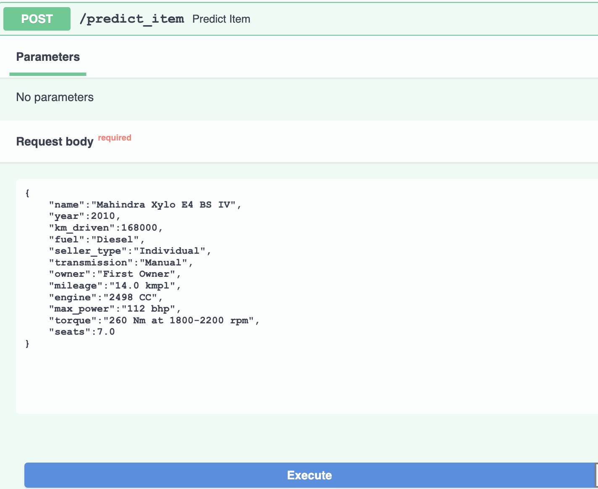
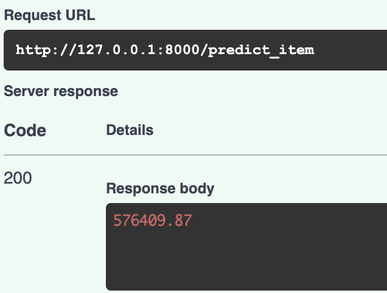
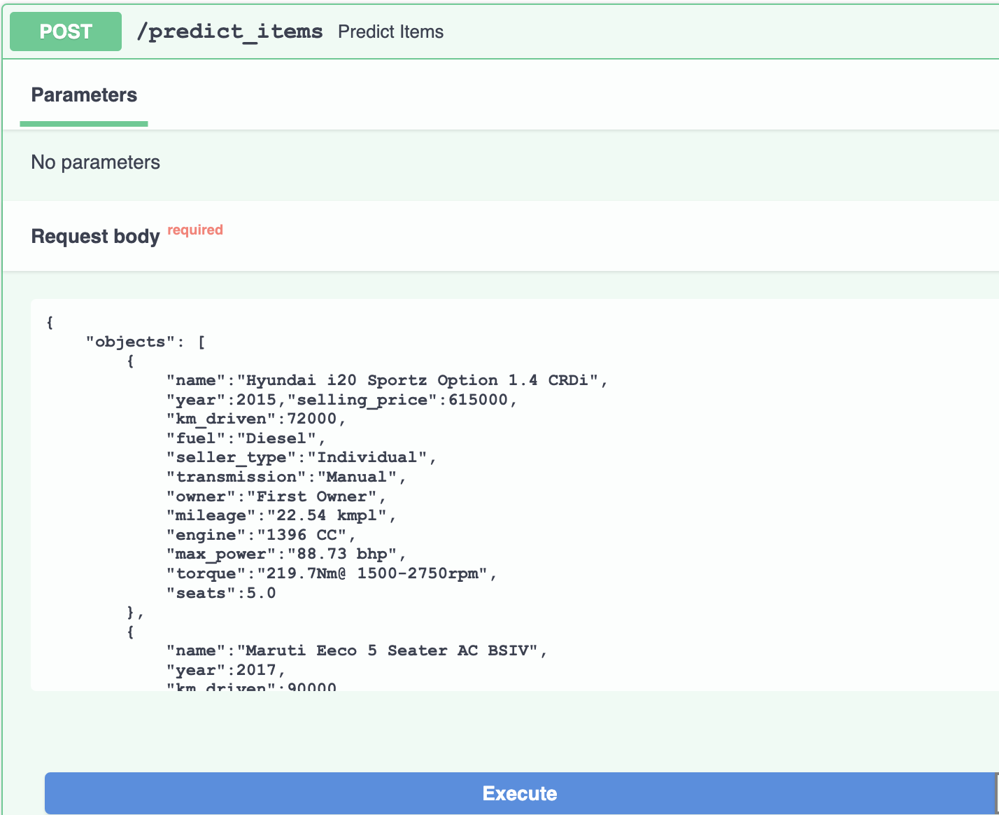
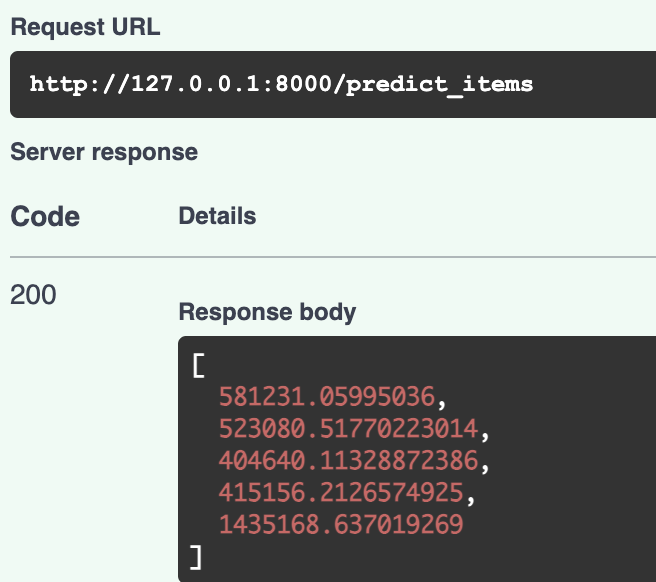
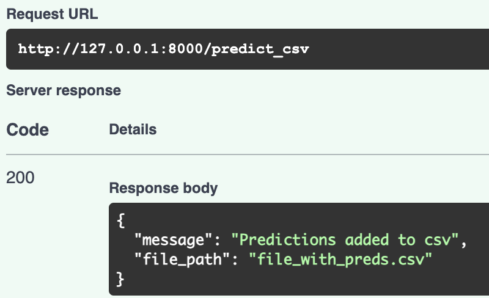
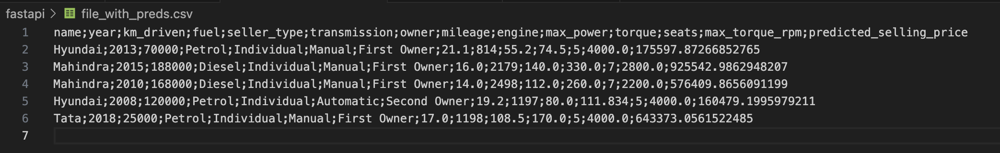

# AI_HW1_pro
Решение ДЗ-1 по курсу ML, НИУ ВШЭ ИИ24

### Состав репозитория
- AI_HW1_pro_Sushkova.ipynb: ноутбук с кодом решения и выводами;
- api.py: файл с кодом сервиса FastApi;
- \pkl files: папка с хранением `.pkl` файлов:
  1. `scaler` - стандартизатор для числовых признаков;
  2. `encoder` - кодировщик OHE для категориальных признаков;
  3. `medians` - медианы числовых признаков для заполнения возможных пропусков;
  4. `model` - обученная Ridge-регрессия.
- \screenshots: папка со скриншотами работы сервиса FastApi

### Summary по работе
#### Что было сделано
- Проведен EDA анализ, датасеты очищены от дублей по признакам, пропуски заполнены медианами. Признаки с единицами измерения приведены к формату float, признак torque разбит на два составных формата float, необходимые колонки приведены к типу int. Текстовый признак name приведен к категориальному посредством извлечения 
- Обучены и протестированы 5 типов моделей. На числовых признаках: линейная регрессия, L1-регуляризация, ElasticNet, L0-регуляризация. На числовых и категориальных, закодированных методом OHE - Ridge-регрессия. Для L1-регуляризации, ElasticNet и Ridge-регрессии проведена кросс-валидация для определения оптимальных гиперпараметров. Финализированные модели после валидации были протестированы на тестовом наборе данных.
- Реализованы и применены бизнес-метрики для сравнения моделей;
- Реализован FastApi сервис с тремя ручками:
  1. `/predict_item` - принимает на вход json-представление признаков объекта, отдает предсказанную цену;
  2. `/predict_items` - принимает на вход json-массив представлений признаков объектов, отдает список предсказанных цен;
  3. `/predict_csv` - принимает на вход csv-файл с признаками объекта, отдает csv-файл с добавленным столбцом предсказанных цен.

  Из модели убрана целевая переменная `selling_price`, которая собственно не участвует в предсказании. В качестве модели в сервисе используется `Ridge`, которая показала лучшие значения метрик качества. Помимо предобработки входных данных, которая идентична части EDA задания, на основе `.pkl` файлов применяется стандартизация числовых признаков, кодирование OHE категориальных признаков, заполнение пропусков значениями медиан и наконец предсказание на основе обученной модели.

#### Результаты и лучший буст
В целом, все пять моделей выдавали на тестовых данных $MSE$ порядка $10^{12}$, что очевидно много. Модели на числовых признаках объяснили лишь $60\%$ вариаций цены, что также не очень эффективно. Кросс-валидация хотя и попыталась подобрать лучшие гиперпараметры для минимизации $MSE$, однако в абсолютном выражении метрик результаты сложно назвать оптимальными. L1-регуляризация не занулила ни один из весов, хотя ее использование, как правило, направлено именно на отсеивание ненужных фичей. L1-регуляризация на тестовых данных также показала, что набор из всех исходных $8$ числовых признаков дает наилучшие показатели метрик качества. Хотя при исследовании корреляций были предположения, что присутствует мультиколлинеарность (например, между `engine` и `max_power` наблюдается сильная линейная зависимость). 
Тем не менее, для `Ridge` это значение ошибки было практически в $2$ раза меньше, чем на остальных моделях. Также на $10\%$ увеличилась объясненная вариация целевой переменной, то есть коэффициент детерминации $R^2$ вырос до $0.7$. Бизнес-метрики вышли заметно лучше именно для метода L2-регуляризации. Это говорит о том, что добавление в модель категориальных признаков хорошо сказалось на предсказательной способности (иначе говоря, они вносят значительный вклад в формирование целевой переменной). Сам метод L2-регуляризации зарекомендовал себя лучше прочих на данном датасете. Он направлен не на зануление незначительных весов, а на сохранение всех признаков с введением штрафов, понижая значимость фичей при необходимости.

#### Что не удалось сделать
Не удалось выполнить бонусную часть с Feature Engineering (просто из-за неватки времени...) 
В ноутбуке в данной части приведены мысли по поводу того, какие методы дополнительной предобработки данных я бы применила.

### Работа сервиса FastApi
*Скриншоты приведены из Swagger UI* 
*Также можно посмотреть демо работы сервиса: [ДЕМО](https://drive.google.com/file/d/1UlR7QAeyYUShQqqvi30irEbhq1xY6UM9/view?usp=sharing)*
#### Ручка /predict_item
Подача json-представления признаков объекта: 
 
Результат предсказания цены: 
 
#### Ручка /predict_items
Подача массива-json представлений признаков объектов: 
 
Список предсказанных цен: 
 
#### Ручка /predict_csv
CSV-файл на вход: 
 
Ответ сервиса с именем выходного файла: 
 
CSV-файл на входе: 
 
